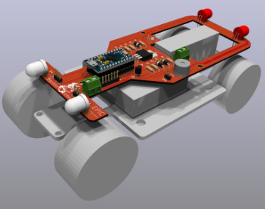

# epic-car-control

Arduino-based model car control for EPIC.  This is a PCB which mounts
on a model car used in the Partner Classes taught at EPIC.



* [Software Development Log](SoftwareLog.md)
* [Wiring Diagram](Slides/wiring_diagram.pdf) -- how to wire the PCB to the car
* [Programming Instructions](Slides/car_program.pdf) -- instructions to change the target distance

## Hardware features

* Arduino pro micro socket
* MOSFET for motor control
* Optical sensor for wheel revolution counter
* Headlights and taillights with individual control
* Small speaker
* Bottom-mounted pushbutton switch for user inputs
* Screw terminal connectors for a 6V battery pack (4xAA) and motor
* Header connector for a power switch

## Software

Current software in `Arduino/car_control/car_control.ino`

```
power-up reads distance set from EEPROM
   long (error) beep means invalid setting (default to 5)
Idle mode
   short press - drive for programmed distance
   long press - move to 10's set mode
10's set mode
   short press: add 10 revs
   long press: to 1's set mode
1's set mode
   short press: add 1 revs
   long press: save setting and exit to IDLE
```

Current setting displayed in binary on LEDs as

| Location    | Value |
|:------------|:------|
| Right Front | 1     |
| Left Front  | 2     |
| Left Rear   | 4     |
| Right Rear  | 8     |

(value is sum of lit LEDs, or zero if all off)

Note that the current setting can be displayed with:

* **Long Press** - display 10's
* **Long Press** - display 1's
* **Long Press** - return to idle

Sensor test:

* Hold button while powering up
* Then press the button repeatedly:
  * first press: long beep, take reading, display low 4 bits
  * second press: display high 4 bits

Power down and up to exit test mode
